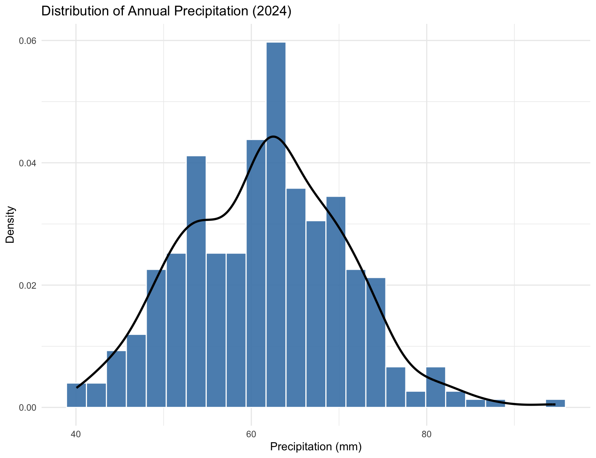
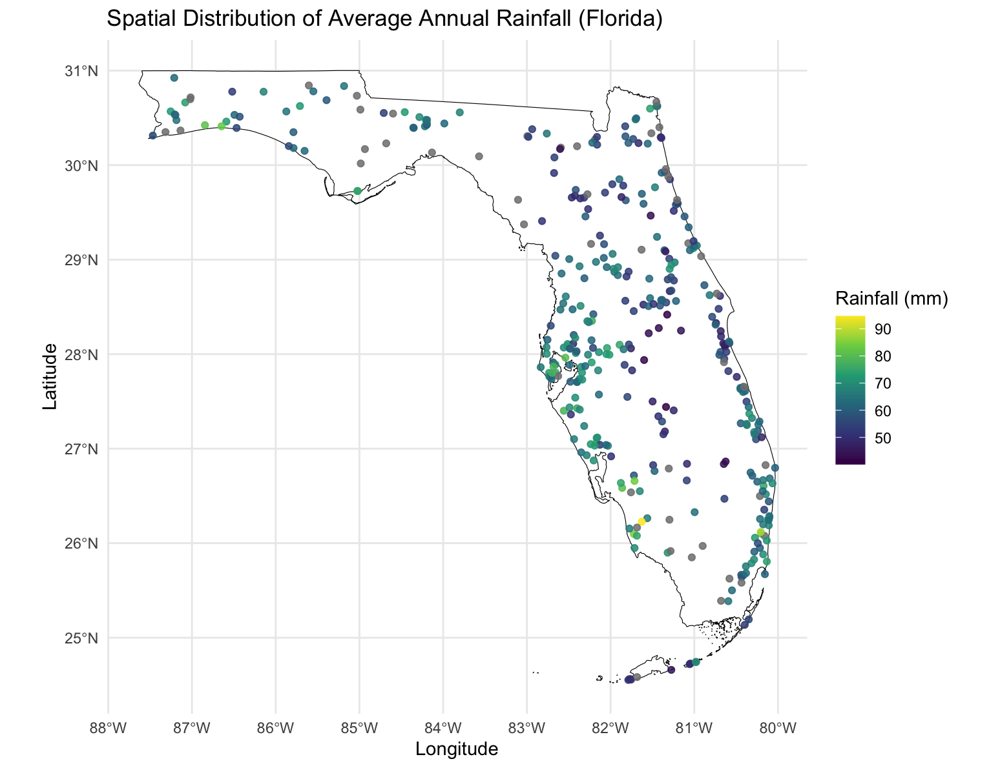
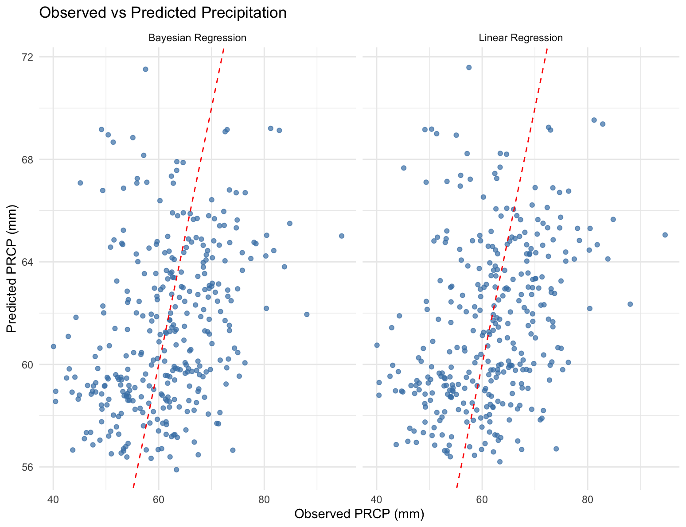
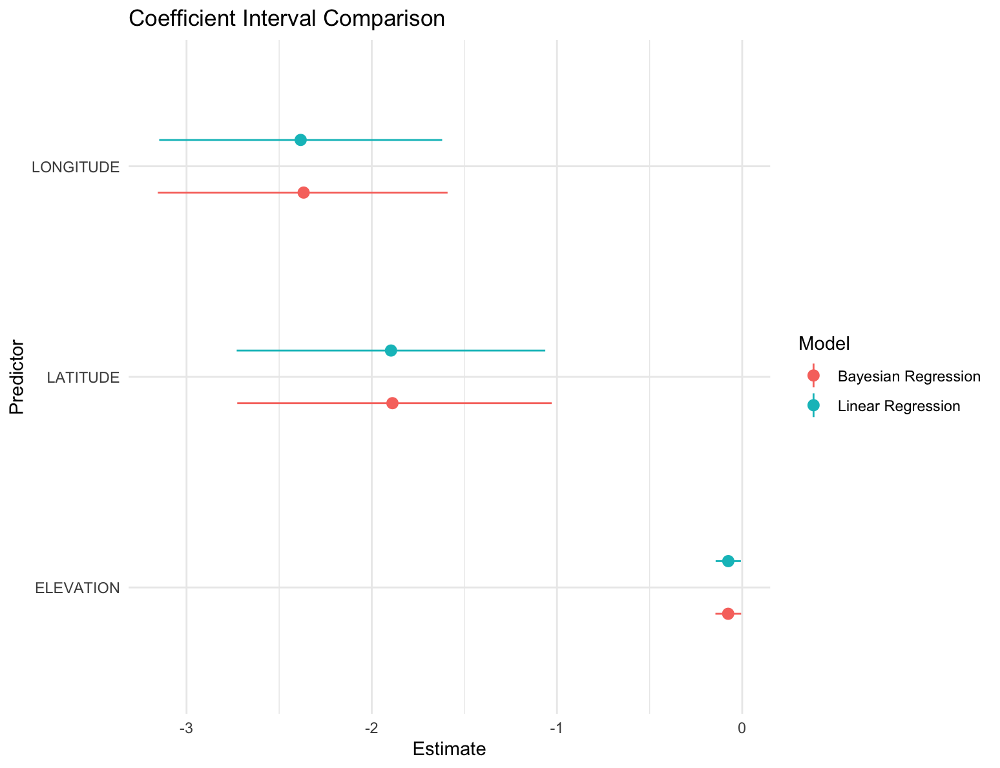
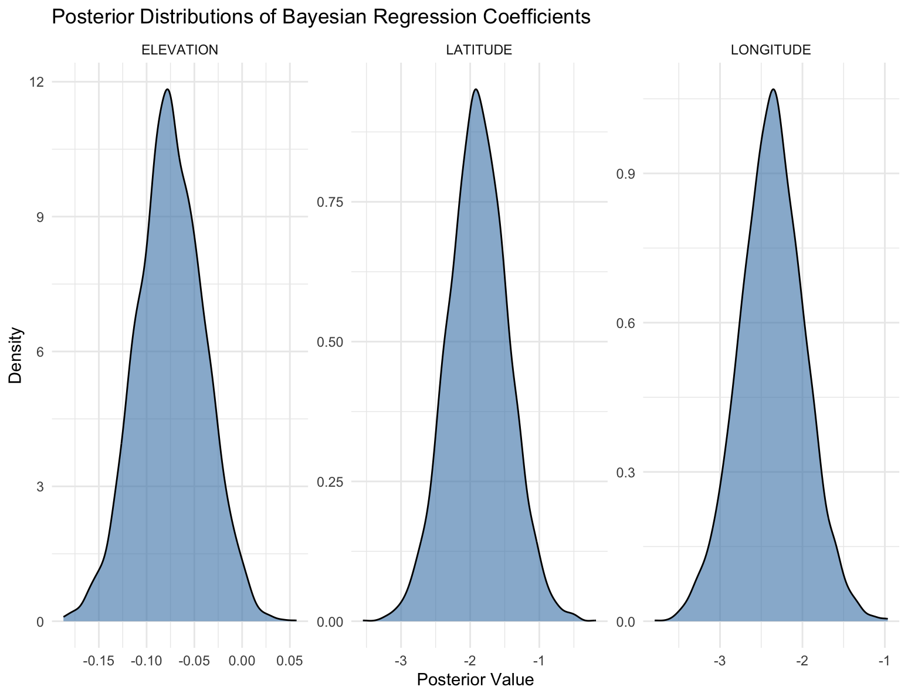
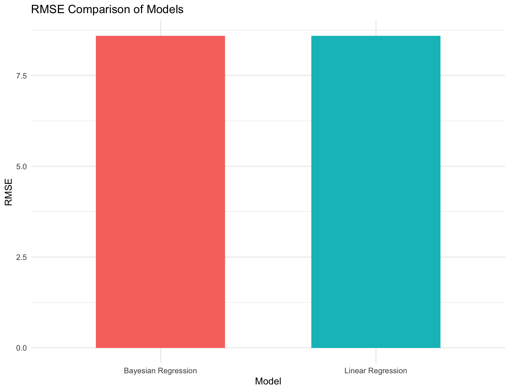
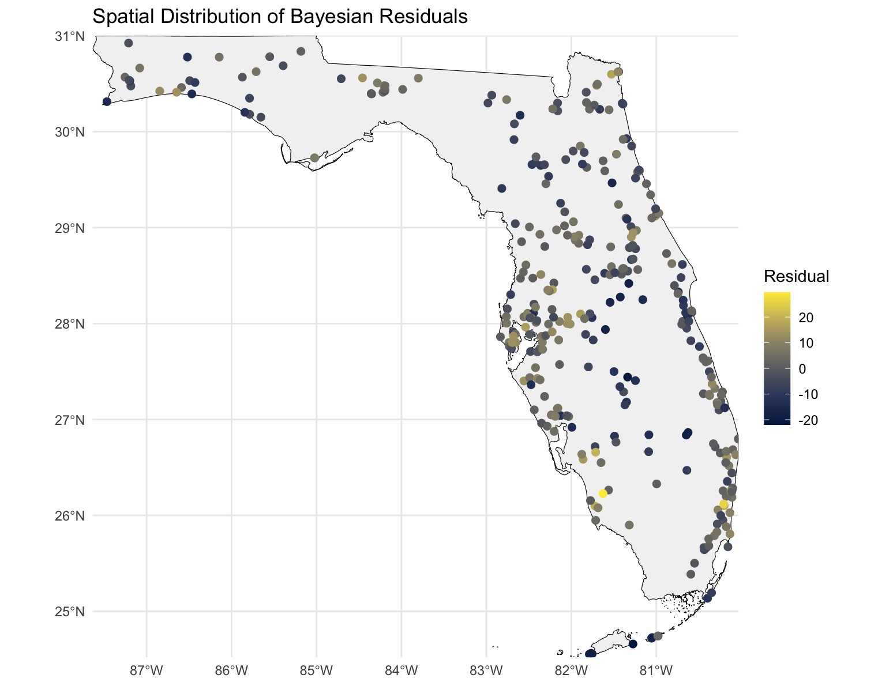
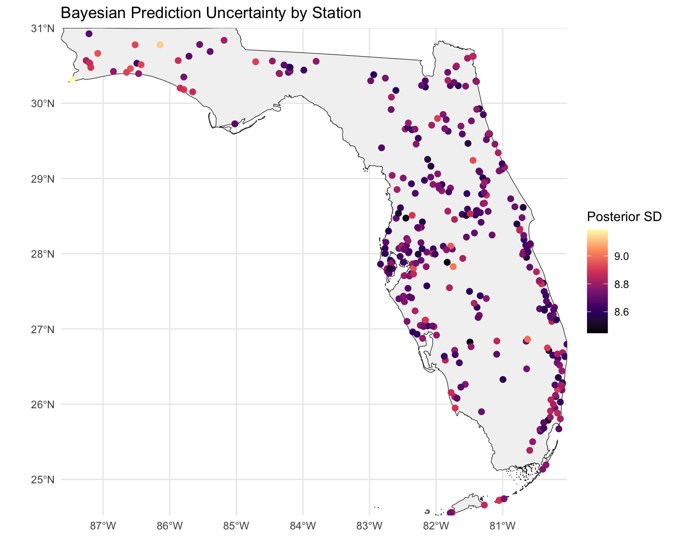

## Motivation

- Rainfall is critical for environmental and resource planning
- Spatial variation is important for modeling
- Classical regression provides point estimates
- Rainfall prediction has been studied using linear regression and Bayesian methods [@ahmed2021rainfall; @chen2022related]

---

## Project Objective

- Model rainfall using geographic predictors
- Compare:
  - Linear Regression (baseline)
  - Bayesian Regression (primary)
- Evaluate:
  - Prediction performance
  - Interpretation
  - Uncertainty quantification

---

## Dataset Overview {style="font-size: 0.8em;"}

- NOAA GSOY dataset (2024)
- Florida weather stations
- Variables:
  - PRCP (precipitation)
  - Latitude
  - Longitude
  - Elevation
- Data preprocessing:
  - Filtered Florida stations
  - Selected relevant variables
  - Removed missing values

---

## Data Distribution {style="font-size: 0.7em;"}

- Rainfall shows moderate spread
- Suitable for regression modeling

{fig-align="center"}

---

## Spatial Rainfall Pattern {style="font-size: 0.7em;"}

- Rainfall varies across Florida
- Indicates spatial dependency

{fig-align="center"}

---

## Methodology {style="font-size: 0.75em;"}

- Linear Regression:
  - Baseline model

- Bayesian Regression:
  - Uses prior distributions
  - Produces posterior distributions
  - Captures uncertainty [@ma2020hierarchical]

**Model:**  
PRCP ~ Latitude + Longitude + Elevation  

- Bayesian approach enables probabilistic interpretation and uncertainty estimation

---

## Model Fit {style="font-size: 0.7em;"}

- Both models follow observed trends
- Some variability remains

{fig-align="center"}

---

## Coefficient Comparison {style="font-size: 0.7em;"}

- All predictors have negative effects
- Bayesian and linear estimates are similar

{fig-align="center"}

---

## Posterior Distributions {style="font-size: 0.7em;"}

- Parameters represented as distributions
- Stable and consistent estimates

{fig-align="center"}

---

## Model Performance {style="font-size: 0.7em;"}

- RMSE values are nearly identical
- Similar predictive performance

{fig-align="center"}

---

## Residual Analysis {style="font-size: 0.7em;"}

- No strong spatial bias
- Some local variation

{fig-align="center"}

---

## Bayesian Uncertainty {style="font-size: 0.7em;"}

- Shows uncertainty across locations
- Key advantage of Bayesian approach

{fig-align="center"}

---

## Key Findings

- Rainfall varies spatially
- Geographic variables influence precipitation
- Bayesian and Linear models are similar
- Comparison with baseline regression helps assess predictive performance [@kumari2023performance]

---

## Main Insight

- Prediction accuracy is similar
- Bayesian adds:
  - Credible intervals
  - Posterior distributions
  - Uncertainty quantification

---

## Conclusion

- Bayesian regression enhances interpretation
- Useful for uncertainty analysis
- Strong tool for spatial modeling

---

## Future Work

- Use multi-year data
- Include more predictors
- Explore advanced spatial models

---

## References